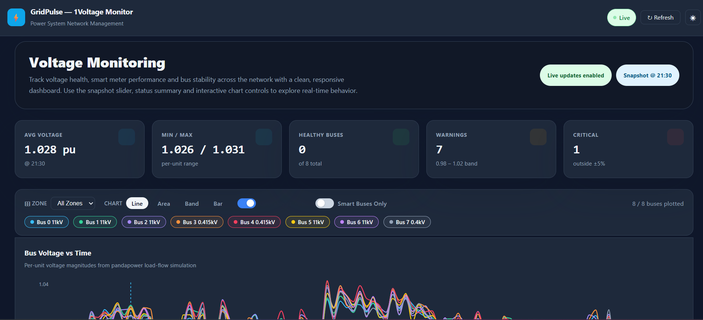
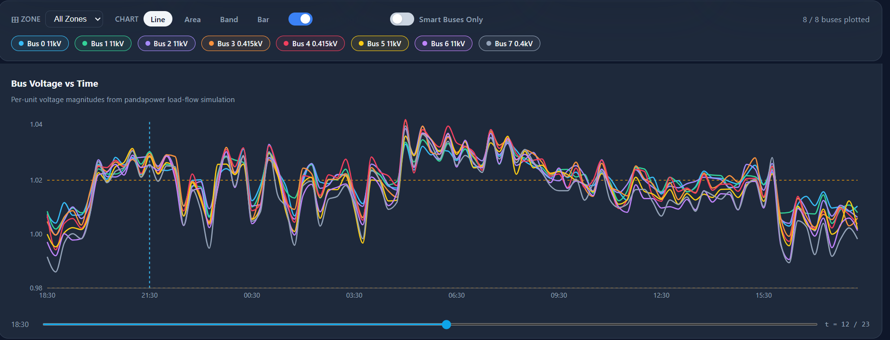
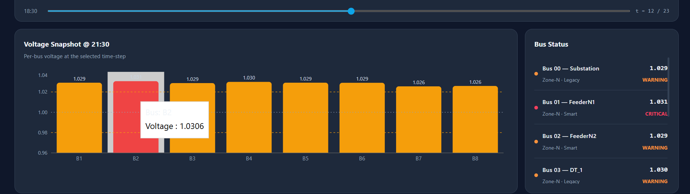
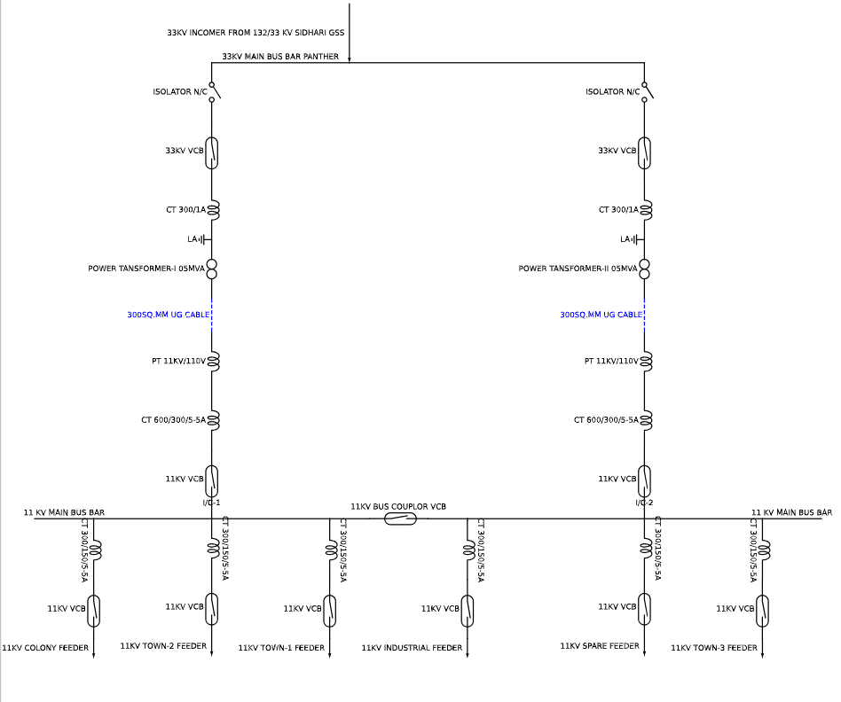

# PowerGrid--Network-Management-System-for-Load-flow-analysis
### *Real-time Power Grid Monitoring & Live Voltage Dashboard — from DISCOM to Feeder Level*

[](https://www.djangoproject.com/)
[](https://reactjs.org/)
[](https://www.postgresql.org/)
[](https://www.docker.com/)
[](LICENSE)

---

> 🔋 **GridVision NMS** is a full-stack Network Management System for visualizing and monitoring power distribution networks in real time — featuring live voltage dashboards, Single Line Diagrams (SLD), and smart meter analytics powered by Pandapower and Pandas.

---

## 📚 Table of Contents

- [✨ Key Features](#-key-features)
- [🛠️ Built With](#️-built-with)
- [📸 Screenshots](#-screenshots)
- [🚀 Getting Started](#-getting-started)
  - [Prerequisites](#prerequisites)
  - [Installation](#installation)
  - [Running with Docker](#running-with-docker)
- [📡 API Endpoints](#-api-endpoints)
- [💻 Usage Examples](#-usage-examples)
- [🤝 Contributing](#-contributing)
- [📄 License](#-license)

---

## ✨ Key Features

- ⚡ **Live Voltage Monitoring Dashboard** — Real-time voltage readings across bus nodes with visual alerts
- 🗺️ **Single Line Diagram (SLD)** — Auto-generated multi-level power grid diagrams using `schemdraw`
- 📊 **Smart Meter Analytics** — Consumption trends and anomaly detection powered by Pandas & NumPy
- 🔌 **Power Flow Simulation** — Electrical load-flow calculations using Pandapower
- 🌐 **RESTful API** — Clean Django REST Framework endpoints serving bus data, smart meter readings, and graph data
- 🐳 **Dockerized** — One-command deployment, zero environment headaches
- 📶 **DISCOM → Feeder Level** — Full distribution hierarchy visualization

---

## 🛠️ Built With

| Layer | Technology | Purpose |
|---|---|---|
| **Frontend** |  | Live dashboard UI |
| **Backend** |  | REST API & business logic |
| **API Framework** |  | RESTful endpoint design |
| **Database** |  | Persistent data store |
| **Power Simulation** |  | Load flow & electrical calcs |
| **Data Processing** |   | CSV parsing & analytics |
| **Diagram** | `schemdraw` | Auto-generated SLD visuals |
| **DevOps** |  | Containerized deployment |

---

## 📸 Screenshots


## Dashboard






## Single Line Diagram



## 🚀 Getting Started

### Prerequisites

Make sure you have the following installed:

- 🐍 Python `3.10+`
- 🟢 Node.js `18+` & npm
- 🐘 PostgreSQL `15+`
- 🐳 Docker & Docker Compose

---

### Installation

#### 1️⃣ Clone the Repository

```bash
git clone https://github.com/Nitya-11/PowerGrid--Network-Management-System-for-Load-flow-analysis.git
cd gridvision-nms
```

#### 2️⃣ Backend Setup (Django)

```bash
# Create and activate a virtual environment
python -m venv venv
source venv/bin/activate        # On Windows: venv\Scripts\activate

# Install Python dependencies
pip install -r requirements.txt
```

#### 3️⃣ Configure Environment Variables

Create a `.env` file in the project root:

```env
# .env
DEBUG=True
SECRET_KEY=your-secret-key-here

# PostgreSQL
DB_NAME=gridvision_db
DB_USER=postgres
DB_PASSWORD=yourpassword
DB_HOST=localhost
DB_PORT=5432
```

#### 4️⃣ Database Setup

```bash
# Apply migrations
python manage.py migrate

# Load initial power grid data (if fixture provided)
python manage.py loaddata initial_grid_data.json

# Create a superuser
python manage.py createsuperuser
```

#### 5️⃣ Run the Django Development Server

```bash
python manage.py runserver
# API available at: http://127.0.0.1:8000/api/
```

#### 6️⃣ Frontend Setup (React)

```bash
cd frontend
npm install
npm start
# Dashboard available at: http://localhost:3000
```

---

### Running with Docker 🐳

The easiest way to get everything running:

```bash
# Build and start all services (Django + React + PostgreSQL)
docker-compose up --build

# Run in detached mode
docker-compose up -d --build

# Stop all services
docker-compose down
```

Services will be available at:
| Service | URL |
|---|---|
| React Dashboard | `http://localhost:3000` |
| Django API | `http://localhost:8001/api/` |
| Django Admin | `http://localhost:8001/admin/` |

---

## 📡 API Endpoints

| Method | Endpoint | Description |
|---|---|---|
| `GET` | `/api/bus-data/` | Fetch all bus node voltage & power data |
| `GET` | `/api/smart-meter/` | Retrieve smart meter readings per feeder |
| `GET` | `/api/graph-data/` | Get processed graph data for SLD visualization |
| `GET` | `/api/power-flow/` | Run Pandapower load flow simulation results |

---

## 💻 Usage Examples

### 🔌 Fetch Live Bus Voltage Data

```python
import requests

response = requests.get("http://localhost:8001/api/bus-data/")
data = response.json()

for bus in data["buses"]:
    print(f"Bus {bus['id']} — Voltage: {bus['vm_pu']} pu | Status: {bus['status']}")
```

**Sample Response:**

```json
{
  "buses": [
    { "id": 1, "name": "DISCOM_HQ", "vm_pu": 1.02, "status": "normal" },
    { "id": 2, "name": "Feeder_A",  "vm_pu": 0.97, "status": "warning" },
    { "id": 3, "name": "Feeder_B",  "vm_pu": 0.85, "status": "critical" }
  ]
}
```

---

### 📊 Run a Pandapower Load Flow Simulation

```python
import pandapower as pp

# Create a simple grid network
net = pp.create_empty_network()

# Add a bus
b1 = pp.create_bus(net, vn_kv=11., name="DISCOM Bus")
b2 = pp.create_bus(net, vn_kv=0.4, name="Feeder A")

# Add transformer and load
pp.create_transformer(net, hv_bus=b1, lv_bus=b2, std_type="0.4 MVA 10/0.4 kV")
pp.create_load(net, bus=b2, p_mw=0.2, q_mvar=0.05)
pp.create_ext_grid(net, bus=b1)

# Run load flow
pp.runpp(net)
print(net.res_bus)   # Voltage results per bus
```

---

### 🗺️ Generate a Single Line Diagram

```python
import schemdraw
import schemdraw.elements as elm

with schemdraw.Drawing() as d:
    d += elm.Line().right().label("DISCOM", loc="top")
    d += elm.Transformer().down().label("33/11 kV")
    d += elm.Line().right().label("Feeder A", loc="top")
    d += elm.BulbIEC().right().label("Load", loc="top")

d.save("sld_diagram.png")
```

---

### ⚛️ Live Voltage Chart in React (Example Component)

```jsx
import { useEffect, useState } from "react";
import { LineChart, Line, XAxis, YAxis, CartesianGrid, Tooltip } from "recharts";

export default function VoltageMonitor() {
  const [data, setData] = useState([]);

  useEffect(() => {
    const interval = setInterval(async () => {
      const res = await fetch("/api/bus-data/");
      const json = await res.json();
      setData(prev => [...prev.slice(-20), ...json.buses]);
    }, 3000); // Poll every 3 seconds

    return () => clearInterval(interval);
  }, []);

  return (
    <LineChart width={700} height={300} data={data}>
      <CartesianGrid strokeDasharray="3 3" />
      <XAxis dataKey="name" />
      <YAxis domain={[0.8, 1.1]} />
      <Tooltip />
      <Line type="monotone" dataKey="vm_pu" stroke="#00e5ff" dot={false} />
    </LineChart>
  );
}
```

---

## 🤝 Contributing

Contributions are welcome and appreciated! 🙌

```bash
# 1. Fork the repository
# 2. Create your feature branch
git checkout -b feature/your-feature-name

# 3. Commit your changes
git commit -m "feat: add your feature description"

# 4. Push to the branch
git push origin feature/your-feature-name

# 5. Open a Pull Request
```

### Guidelines

- ✅ Follow PEP8 for Python code
- ✅ Use ESLint rules for React/JavaScript
- ✅ Write meaningful commit messages (use [Conventional Commits](https://www.conventionalcommits.org/))
- ✅ Add docstrings to new API views and utility functions
- ✅ Test your changes before submitting a PR

---

## 📄 License

This project is licensed under the **MIT License** — see the [LICENSE](LICENSE) file for details.

```
MIT License

Copyright (c) 2026 Nitya Singh

Permission is hereby granted, free of charge, to any person obtaining a copy
of this software and associated documentation files (the "Software"), to deal
in the Software without restriction...
```

---

<div align="center">

Made with ❤️ by **[Nitya Singh](https://github.com/Nitya-11)**

[](https://www.linkedin.com/in/nitya-singh-5b7490317/)
[](https://github.com/Nitya-11)

⭐ *If you found this useful, please consider giving it a star!* ⭐

</div>
